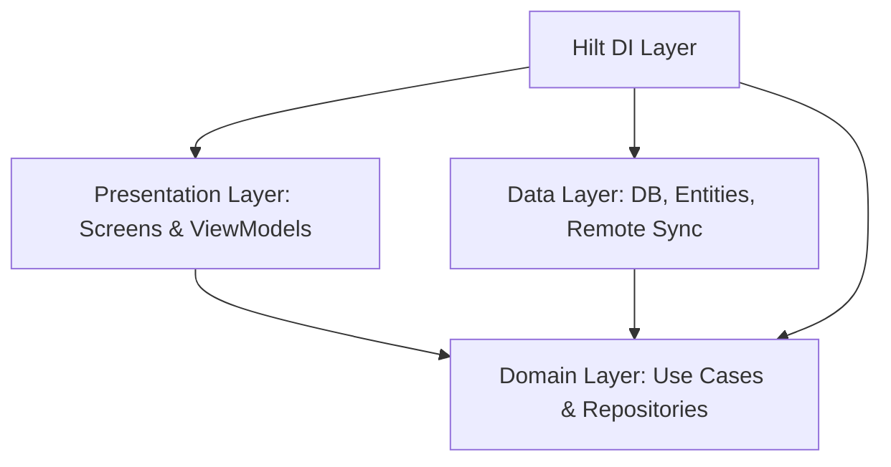

# Solo Leveling SystemFit - Extensive Knowledge Document

This document serves as the absolute technical reference and system specification for the **Solo Leveling SystemFit** Android application. It details every architectural layer, data schema, algorithmic calculation, theme configuration, and user interface element in the codebase.

---

## 🏛️ 1. Architecture & Folder Structure

The application is built using **Clean Architecture** principles and **MVVM (Model-View-ViewModel)** pattern, ensuring strict separation of concerns, unit testability, and offline capability.



### File Catalog & Layer Breakdown

#### 📂 App Configuration & Resources
*   [AndroidManifest.xml](file:///C:/Users/renny/OneDrive/Documents/GitHub/level-up/app/src/main/AndroidManifest.xml): Configures immersive full-screen themes, starting entry-point activities, and permissions.
*   [app/build.gradle.kts](file:///C:/Users/renny/OneDrive/Documents/GitHub/level-up/app/build.gradle.kts): Manages Jetpack Compose, Room, Hilt, Firebase BOM, Coil, and testing dependencies.
*   [build.gradle.kts](file:///C:/Users/renny/OneDrive/Documents/GitHub/level-up/build.gradle.kts): Root project configuration defining stable plugin versions (Kotlin `1.9.22`, Hilt `2.51.1`, KSP `1.9.22-1.0.17`).

#### 📂 Domain Layer (`com.sololeveling.systemfit.domain`)
Defines the enterprise business rules, data contracts, and logical use cases independent of database frameworks or UI technologies.
*   **Models:**
    *   [User.kt](file:///C:/Users/renny/OneDrive/Documents/GitHub/level-up/app/src/main/java/com/sololeveling/systemfit/domain/model/User.kt): Player profile model holding stats, streaks, selected theme styles, and XP formulas.
    *   [Exercise.kt](file:///C:/Users/renny/OneDrive/Documents/GitHub/level-up/app/src/main/java/com/sololeveling/systemfit/domain/model/Exercise.kt): Core exercise definition containing type categories, safety tags, and instruction details.
    *   [ExerciseType.kt](file:///C:/Users/renny/OneDrive/Documents/GitHub/level-up/app/src/main/java/com/sololeveling/systemfit/domain/model/ExerciseType.kt): Enum class (`ISOMETRIC_HOLD`, `CARDIO`, `FLEXIBILITY`, `STRENGTH`).
*   **Repositories (Interfaces):**
    *   [UserRepository.kt](file:///C:/Users/renny/OneDrive/Documents/GitHub/level-up/app/src/main/java/com/sololeveling/systemfit/domain/repository/UserRepository.kt): Contract for CRUD operations on users and workout log histories.
    *   [ExerciseRepository.kt](file:///C:/Users/renny/OneDrive/Documents/GitHub/level-up/app/src/main/java/com/sololeveling/systemfit/domain/repository/ExerciseRepository.kt): Contract for fetching complete or filtered exercise datasets.
*   **Use Cases:**
    *   [GenerateDailyQuestUseCase.kt](file:///C:/Users/renny/OneDrive/Documents/GitHub/level-up/app/src/main/java/com/sololeveling/systemfit/domain/usecase/GenerateDailyQuestUseCase.kt): Algorithmic builder mapping stats, levels, and safety rules to the daily routine.
    *   [ProcessWorkoutResultUseCase.kt](file:///C:/Users/renny/OneDrive/Documents/GitHub/level-up/app/src/main/java/com/sololeveling/systemfit/domain/usecase/ProcessWorkoutResultUseCase.kt): Calculates XP increments, handles double level ups, streaks, and cleanses penalty markers.
    *   [EmergencyHaltUseCase.kt](file:///C:/Users/renny/OneDrive/Documents/GitHub/level-up/app/src/main/java/com/sololeveling/systemfit/domain/usecase/EmergencyHaltUseCase.kt): Manages the duration of the emergency nasal recovery zone.

#### 📂 Data Layer (`com.sololeveling.systemfit.data`)
Implements domain repository interfaces, manages Room local database caches, and coordinates Firebase Firestore cloud sync.
*   **Database & DAO:**
    *   [SystemDatabase.kt](file:///C:/Users/renny/OneDrive/Documents/GitHub/level-up/app/src/main/java/com/sololeveling/systemfit/data/local/SystemDatabase.kt): Manages the SQLite database instance (Schema version `4`) with Destructive Migration and profile auto-seeding.
    *   [UserDao.kt](file:///C:/Users/renny/OneDrive/Documents/GitHub/level-up/app/src/main/java/com/sololeveling/systemfit/data/local/dao/UserDao.kt): Query interface for profile reads and updates.
    *   [ExerciseDao.kt](file:///C:/Users/renny/OneDrive/Documents/GitHub/level-up/app/src/main/java/com/sololeveling/systemfit/data/local/dao/ExerciseDao.kt): Methods to seed and fetch standard and safety-filtered exercises.
    *   [WorkoutLogDao.kt](file:///C:/Users/renny/OneDrive/Documents/GitHub/level-up/app/src/main/java/com/sololeveling/systemfit/data/local/dao/WorkoutLogDao.kt): Logs entries for quests, partial emergency halts, and penalty survivals.
*   **Entities:**
    *   [UserEntity.kt](file:///C:/Users/renny/OneDrive/Documents/GitHub/level-up/app/src/main/java/com/sololeveling/systemfit/data/local/entity/UserEntity.kt) / [ExerciseEntity.kt](file:///C:/Users/renny/OneDrive/Documents/GitHub/level-up/app/src/main/java/com/sololeveling/systemfit/data/local/entity/ExerciseEntity.kt) / [WorkoutLogEntity.kt](file:///C:/Users/renny/OneDrive/Documents/GitHub/level-up/app/src/main/java/com/sololeveling/systemfit/data/local/entity/WorkoutLogEntity.kt)
*   **Repository Implementations:**
    *   [UserRepositoryImpl.kt](file:///C:/Users/renny/OneDrive/Documents/GitHub/level-up/app/src/main/java/com/sololeveling/systemfit/data/repository/UserRepositoryImpl.kt) / [ExerciseRepositoryImpl.kt](file:///C:/Users/renny/OneDrive/Documents/GitHub/level-up/app/src/main/java/com/sololeveling/systemfit/data/repository/ExerciseRepositoryImpl.kt)
*   **Remote Sync Source:**
    *   [RemoteSyncSource.kt](file:///C:/Users/renny/OneDrive/Documents/GitHub/level-up/app/src/main/java/com/sololeveling/systemfit/data/remote/DataSource/RemoteSyncSource.kt) / [FirestoreUserDto.kt](file:///C:/Users/renny/OneDrive/Documents/GitHub/level-up/app/src/main/java/com/sololeveling/systemfit/data/remote/model/FirestoreUserDto.kt): Offline-tolerant Firestore sync channel.

#### 📂 DI Layer (`com.sololeveling.systemfit.di`)
Configures Hilt dependency injection scopes.
*   [DatabaseModule.kt](file:///C:/Users/renny/OneDrive/Documents/GitHub/level-up/app/src/main/java/com/sololeveling/systemfit/di/DatabaseModule.kt): Provides Room database, DAO providers, and seeds default exercises.
*   [FirebaseModule.kt](file:///C:/Users/renny/OneDrive/Documents/GitHub/level-up/app/src/main/java/com/sololeveling/systemfit/di/FirebaseModule.kt): Provides Firebase Firestore references.
*   [RepositoryModule.kt](file:///C:/Users/renny/OneDrive/Documents/GitHub/level-up/app/src/main/java/com/sololeveling/systemfit/di/RepositoryModule.kt): Binds repository interfaces to implementations.

#### 📂 Presentation Layer (`com.sololeveling.systemfit.presentation`)
Handles the user interface, custom Compose draw operations, responsive layout systems, and raw media playback.
*   **Flow Core:**
    *   [MainActivity.kt](file:///C:/Users/renny/OneDrive/Documents/GitHub/level-up/app/src/main/java/com/sololeveling/systemfit/presentation/main/MainActivity.kt): Immersive fullscreen flag configurations and dynamic rank sub-theme wrapper.
    *   [Navigation.kt](file:///C:/Users/renny/OneDrive/Documents/GitHub/level-up/app/src/main/java/com/sololeveling/systemfit/presentation/main/Navigation.kt): Routes transition parameters and halts active startup music.
    *   [SplashScreen.kt](file:///C:/Users/renny/OneDrive/Documents/GitHub/level-up/app/src/main/java/com/sololeveling/systemfit/presentation/main/SplashScreen.kt): Typewriter status log feed and loading synchronizer.
*   **Dashboard Screen:**
    *   [DashboardScreen.kt](file:///C:/Users/renny/OneDrive/Documents/GitHub/level-up/app/src/main/java/com/sololeveling/systemfit/presentation/dashboard/DashboardScreen.kt): Multi-tab layout (Home Status, Quests, Analytics, Settings folder view).
    *   [DashboardViewModel.kt](file:///C:/Users/renny/OneDrive/Documents/GitHub/level-up/app/src/main/java/com/sololeveling/systemfit/presentation/dashboard/DashboardViewModel.kt): Bridges database mutations (rename, re-spec ranks, update target days) to dashboard screens.
*   **Workout Screen:**
    *   [WorkoutScreen.kt](file:///C:/Users/renny/OneDrive/Documents/GitHub/level-up/app/src/main/java/com/sololeveling/systemfit/presentation/workout/WorkoutScreen.kt): Visual execution flow (active set countdown ring, rest intervals, panic recovery triggers, penalty zone, claim rewards screens).
    *   [WorkoutViewModel.kt](file:///C:/Users/renny/OneDrive/Documents/GitHub/level-up/app/src/main/java/com/sololeveling/systemfit/presentation/workout/WorkoutViewModel.kt): Core timer state machine handling intervals, pause conditions, and emergency halts.
    *   [WorkoutContract.kt](file:///C:/Users/renny/OneDrive/Documents/GitHub/level-up/app/src/main/java/com/sololeveling/systemfit/presentation/workout/WorkoutContract.kt): Strict interface defining state, events, and side-effects.
*   **Theme Engine:**
    *   [Theme.kt](file:///C:/Users/renny/OneDrive/Documents/GitHub/level-up/app/src/main/java/com/sololeveling/systemfit/presentation/theme/Theme.kt): Computes neon primary and glow card surface colors based on thematic selectors and current player ranks.
    *   [Color.kt](file:///C:/Users/renny/OneDrive/Documents/GitHub/level-up/app/src/main/java/com/sololeveling/systemfit/presentation/theme/Color.kt) / [Type.kt](file:///C:/Users/renny/OneDrive/Documents/GitHub/level-up/app/src/main/java/com/sololeveling/systemfit/presentation/theme/Type.kt)
*   **Components & Utilities:**
    *   [GlitchText.kt](file:///C:/Users/renny/OneDrive/Documents/GitHub/level-up/app/src/main/java/com/sololeveling/systemfit/presentation/components/GlitchText.kt): Customized rendering drawing chromatic aberration layers.
    *   [CountdownRing.kt](file:///C:/Users/renny/OneDrive/Documents/GitHub/level-up/app/src/main/java/com/sololeveling/systemfit/presentation/components/CountdownRing.kt): Custom Canvas arc representation tracking interval counts.
    *   [NeonPanel.kt](file:///C:/Users/renny/OneDrive/Documents/GitHub/level-up/app/src/main/java/com/sololeveling/systemfit/presentation/components/NeonPanel.kt): Canvas modifier drawing neon shadows around panels.
    *   [SoundManager.kt](file:///C:/Users/renny/OneDrive/Documents/GitHub/level-up/app/src/main/java/com/sololeveling/systemfit/presentation/utils/SoundManager.kt): Manages media player pools, volume slider updates, and master toggles.

---

## 🗄️ 2. Room Local Database Schemas

SQLite data persistence is defined in three primary tables: `users`, `workout_logs`, and `exercises`.

### 1. `users` Table
Stores profile metadata, attributes, streak counters, settings toggles, and sync timestamps.

| Column Name | SQLite Data Type | Domain Mapping | Description / Default Value |
| :--- | :--- | :--- | :--- |
| **`id`** *(Primary Key)* | `TEXT` | `id` | Unique ID of the profile. Defaults to `"player_1"`. |
| **`name`** | `TEXT` | `name` | Player Name. Defaults to `"Sung Jin-Woo"`. |
| **`level`** | `INTEGER` | `level` | Current user level. Defaults to `1`. |
| **`currentXp`** | `INTEGER` | `currentXp` | Accumulated XP in current level. Defaults to `0`. |
| **`str`** | `INTEGER` | `str` | Strength Attribute. Defaults to `10`. |
| **`vit`** | `INTEGER` | `vit` | Vitality Attribute. Defaults to `10`. |
| **`agi`** | `INTEGER` | `agi` | Agility Attribute. Defaults to `10`. |
| **`availableStatPoints`** | `INTEGER` | `availableStatPoints` | Unallocated stat points. Defaults to `0`. |
| **`currentStreak`** | `INTEGER` | `currentStreak` | Consecutive days of completed quests. Defaults to `0`. |
| **`bestStreak`** | `INTEGER` | `bestStreak` | Best historical streak record. Defaults to `0`. |
| **`theme`** | `TEXT` | `theme` | Main Look system selected (`SOLO_BLUE`, `MONARCH_RED`, etc.). |
| **`targetWorkoutDaysPerWeek`** | `INTEGER` | `targetWorkoutDaysPerWeek` | Days goal (slider 3 to 7). Defaults to `5`. |
| **`customActiveDurationSeconds`**| `INTEGER` | `customActiveDurationSeconds` | Custom active workout duration. If `0`, formulas are used. |
| **`customRestDurationSeconds`**  | `INTEGER` | `customRestDurationSeconds` | Custom rest interval. If `0`, formulas are used. |
| **`lastWorkoutTimestamp`** | `INTEGER` | `lastWorkoutTimestamp` | Time of last workout. Defaults to `0`. |
| **`penaltyActive`** | `INTEGER` (Boolean)| `penaltyActive` | If `true`, the user is forced into the Penalty Zone next session. |
| **`bpModeActive`** | `INTEGER` (Boolean)| `bpModeActive` | Safety filter for isometrics. Defaults to `true`. |
| **`isDarkMode`** | `INTEGER` (Boolean)| `isDarkMode` | Theme background mode toggle. Defaults to `true`. |
| **`skipIntro`** | `INTEGER` (Boolean)| `skipIntro` | Bypasses Splash typewriter. Defaults to `false`. |

### 2. `workout_logs` Table
Maintains a log history of all completed and partially halted workouts.

| Column Name | SQLite Data Type | Domain Mapping | Description |
| :--- | :--- | :--- | :--- |
| **`logId`** *(Primary Key)* | `INTEGER` *(Auto)* | `logId` | Unique sequential log identifier. |
| **`userId`** | `TEXT` | `userId` | ID of the user who completed the workout. |
| **`timestamp`** | `INTEGER` | `timestamp` | Epoch time when log was recorded. |
| **`xpEarned`** | `INTEGER` | `xpEarned` | Amount of XP granted for this session. |
| **`isCompleted`** | `INTEGER` (Boolean)| `isCompleted` | `true` if cleared successfully; `false` if emergency halted. |
| **`isPenaltyZone`** | `INTEGER` (Boolean)| `isPenaltyZone` | `true` if recorded during a penalty survival run. |

### 3. `exercises` Table
Contains the library of supported exercises, populated during database initialization.

| Column Name | SQLite Data Type | Domain Mapping | Description |
| :--- | :--- | :--- | :--- |
| **`id`** *(Primary Key)* | `TEXT` | `id` | Unique identifier (e.g. `"push_ups"`). |
| **`name`** | `TEXT` | `name` | Human-readable name. |
| **`type`** | `TEXT` (Enum) | `type` | Classification enum (`ISOMETRIC_HOLD`, `CARDIO`, etc.). |
| **`description`** | `TEXT` | `description` | Form guidelines. |
| **`gifUrl`** | `TEXT` | `gifUrl` | Local asset path (e.g. `"file:///android_asset/..."`). |
| **`isHtnSafe`** | `INTEGER` (Boolean)| `isHtnSafe` | Tag indicating safety for users with hypertension. |

---

## 🧮 3. Algorithmic Formulations & Formulas

Core mechanics of progression, interval duration, and difficulty scaling are calculated programmatically:

### 1. Level Up Threshold
XP threshold required to level up from level $L$ to $L+1$:

$$\text{Required XP} = \lfloor 100 \times L^{1.5} \rfloor$$

*Each level up awards $+3$ available stat points to the player.*

### 2. Dynamic Workout Interval Calculations
When custom timers are disabled in settings, exercise durations scale dynamically with player stats:

*   **Active Interval (AGI Scaling):** Agility boosts the duration of active exercise intervals (capped at 60 seconds):

$$\text{Active Seconds} = \min(20 + (\text{agi} \times 2), 60)$$

*   **Rest Interval (VIT Scaling):** Vitality speeds up recovery, shortening rest intervals (floor at 30 seconds):

$$\text{Rest Seconds} = \max(90 - (\text{vit} \times 3), 30)$$

### 3. Workout Difficulty (Sets & Rounds Scaling)
The total number of rounds/sets in the daily quest scales with the player's level $L$ (capped at 5 rounds):

$$\text{Total Rounds} = \min(2 + \lfloor L / 3 \rfloor, 5)$$

### 4. Streak Calculation Rule
*   If the time since the last workout is $\le 24$ hours (days difference $= 1$), the streak increases by $+1$.
*   If the days difference $> 1$, the streak resets to $1$.
*   If the days difference $= 0$ (multiple workouts in the same day), the streak remains unchanged.
*   If the days difference is $\ge 2$ (missed an entire calendar day), a penalty flag is activated, and the streak resets to $0$.

---

## 🔊 4. Audio Engine & Preferences Cache

The app relies on `SoundManager` to play RPG sound effects. It caches preferences using Android's private `SharedPreferences` to decouple audio settings from Room database reads during thread-sensitive audio playbacks.

*   **Preference Filename:** `"system_fit_audio"`
*   **Keys Cached:**
    *   `audio_enabled` (Boolean, default `true`): Master on/off toggle.
    *   `audio_volume` (Float, default `0.5f`): Custom volume level.

### RAW Resource Map & Playback Triggers

| Resource Path | Filename | Sourced From | UI Event Trigger |
| :--- | :--- | :--- | :--- |
| `res/raw/startup.mp3` | `startup` | Sourced Asset | Played during SplashScreen boot typewriter. Bypassed if `skipIntro = true`. |
| `res/raw/level_up.mp3` | `level_up` | Sourced Asset | Played during Victory screen level ups or when confirming Rank Re-specs. |
| `res/raw/claim_rewards.mp3`| `claim_rewards`| Sourced Asset | Played when clicking "Claim Rewards" button. |
| `res/raw/stat_boost.mp3` | `stat_boost` | Sourced Asset | Played when allocating stat points (+ icon). |
| `res/raw/click.mp3` | `click` | Sourced Asset | Played during folder toggles, navigation tabs, or window closures. |
| `res/raw/window_open.mp3` | `window_open` | Sourced Asset | Played when opening dialog screens. |
| `res/raw/penalty.mp3` | `penalty` | Sourced Asset | Played when entering the Penalty Zone or pressing the Panic Button. |

---

## 🎨 5. Dynamic Theme Engine & 24 Sub-Themes

Sub-themes are resolved dynamically by combining the user's chosen Look system with their current Rank.

```
Main Look (Blue/Red/Purple/Green) ✖ Player Rank (E/D/C/B/A/S) = 24 Unique Sub-Theme Styles
```

### 1. Rank Color Mapping

| Theme Name | E-Rank (Base) | D-Rank | C-Rank | B-Rank | A-Rank | S-Rank (Max) |
| :--- | :--- | :--- | :--- | :--- | :--- | :--- |
| **SOLO_BLUE** | Slate Grey (`#64748B`) | Sky Blue (`#38BDF8`) | Cyan (`#06B6D4`) | Ocean Blue (`#0088FF`) | Indigo (`#6366F1`) | Diamond Cyan (`#00F0FF`) |
| **MONARCH_RED** | Dark Red (`#884444`) | Coral (`#F43F5E`) | Rose (`#E11D48`) | Neon Red (`#FF0055`) | Rose Red (`#BE123C`) | Burning Red (`#FF3333`) |
| **SHADOW_PURPLE**| Slate Purple (`#8F70A3`)| Violet (`#A855F7`) | Magenta (`#D946EF`) | Purple (`#8B5CF6`) | Deep Purple (`#6D28D9`)| Neon Pink (`#E879F9`) |
| **GATEKEEPER_GREEN**| Olive (`#658070`) | Mint (`#34D399`) | Emerald (`#10B981`) | Green (`#10B981`) | Jade (`#059669`) | Cyber Green (`#00FF88`) |

### 2. Surface Card Tints (Automation Formula)
Card surface backgrounds ($S$) are computed dynamically using a mix of $5\%$ primary color ($P$) and background ($B$) to generate a premium glow effect:

$$\text{Surface (Dark Mode)} = (P \times 0.08) + 0.05$$

$$\text{Surface (Light Mode)} = (P \times 0.05) + 0.93$$

*This ensures the UI shifts color scheme tones dynamically as the player levels up and changes ranks, making their physical progression visually rewarding.*

---

## 🖥️ 6. Presentation Components & Tab Sections

The app consists of a multi-tab interface organized into 4 primary views:

### 1. Home Tab (Status Screen)
*   **Player Metadata:** Displays name, level, dynamic rank, and XP progress bar ($XP \text{ in level} / \text{needed XP}$).
*   **Stat Allocation Panel:** Shows STR, VIT, and AGI parameters, along with available points. Displays descriptive micro-copy explaining the impact of each stat.
*   **Dungeon Entry Button:**ACCEPT DAILY QUEST button styled in vibrant neon.

### 2. Quests Tab (Daily Goals)
*   **Deterministic List:** Displays the 4 randomly seeded exercises for the day.
*   **Live Parameter Indicators:** Shows target round count and active set duration alongside goals.
*   **Plain English Modifier Panel:** Explains AGI, VIT, LVL, and safety protocol rules in immersive detail.

### 3. Analytics Tab (History & Progress)
*   **Overview Cards:** Multi-column display showing level, rank, today's XP, total XP, streak, and best streak.
*   **Smooth Curve Canvas Graph:** Custom Compose Canvas drawing a smooth cubic curve of the last 7 days of XP gains.
*   **Consistency Row Grid:** 7 boxes representing the last 7 calendar days. Boxes light up with neon borders and checkmarks if a quest was completed.

### 4. Settings Tab (Folder Organized System Controls)
*   **PROFILE CONFIGURATION:** Target days slider (3 to 7).
*   **SYSTEM LOOK & THEME:** Dropdown theme selector and Dark Mode toggle.
*   **AUDIO CONFIGURATION:** Sound effects master toggle and Volume Level slider.
*   **SYSTEM CONTROLS:**
    *   Skip Boot Intro switch.
    *   Choose Starting Rank Badges (E, D, C, B, A, S) to reset profiles and mock levels for testing.
    *   Custom Active and Rest Workout sliders (bypasses formulas if enabled).
*   **DATA MANAGEMENT:** Backup profile, Restore profile, and full System Data Reset buttons.

### 5. Workout Session Screen (Active Combat Loop)
*   **Interactive Set Timer:** Displays active countdowns using `CountdownRing` with color-changing neon arcs.
*   **Set Controls:** Provides skip rest, next/previous exercise, and pause buttons.
*   **Emergency Halt Panic Button:** Instantly records partial XP and redirects the user to the Controlled Recovery Zone.
*   **Controlled Recovery (Nasal Breathing):** A 3-minute nasal breathing countdown with chimes playing every 6 seconds to guide breath pace.
*   **Penalty Zone:** Instantly logs streak resets to 0 and initiates a 3-minute survival timer if the app detects a skipped day.
*   **Victory Screen:** Displays level up animations and XP reward chimes.

---

## 🧪 7. Build and Verification Specifications

All compilation artifacts, database schemas, and unit test suites are fully integrated.

### Automated Test Suite
*   `EmergencyHaltUseCaseTest`: Verifies recovery countdown values.
*   `GenerateDailyQuestUseCaseTest`: Validates deterministic daily seeding.
*   `ProcessWorkoutResultUseCaseTest`: Asserts streak retention, level up calculations, and partial XP scaling.
*   `WorkoutViewModelTest` & `DashboardViewModelTest`: Asserts screen states, events, and preference caches.

To compile debug binaries or run tests:
*   **Compile Debug Sources:** `.\gradlew compileDebugSources`
*   **Run All Unit Tests:** `.\gradlew test`
*   **Assemble Debug APK:** `.\gradlew assembleDebug`
